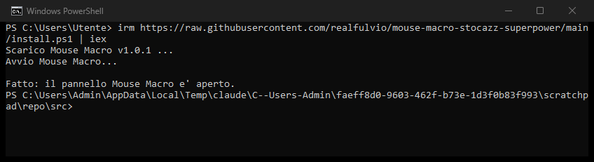
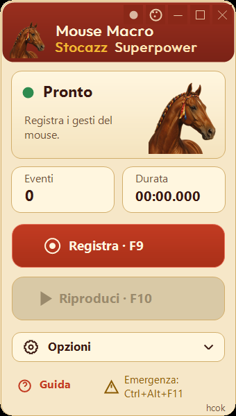
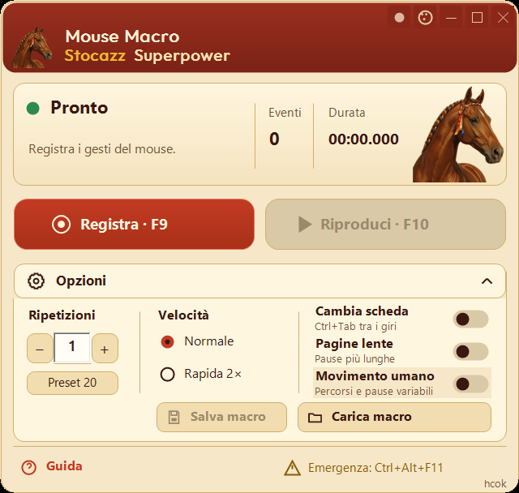

<p align="center"><a href="README.md">Italiano</a> · <b>English</b></p>

<h1 align="center">Mouse Macro Stocazz Superpower</h1>

<p align="center">
Record your mouse, replay it as many times as you need.<br>
A small always-on-top panel for Windows: no installer, no Python to install.
</p>

<p align="center">
<a href="https://github.com/realfulvio/mouse-macro-stocazz-superpower/releases/tag/v1.1.1"><b>⬇ Download for Windows</b></a>
· <a href="GUIDA-ITALIANA.md">Italian guide</a>
· <a href="docs/ESITO-COLLAUDO-v1.1.1.md">Test report</a>
</p>

<p align="center">

&nbsp;

</p>

## Quick start from PowerShell

Starts the app using the signed official Python runtime. No ZIP to download, no exe.

**1.** Open PowerShell (Windows key, type `PowerShell`, Enter).

**2.** Paste this command and press Enter:

```powershell
irm https://raw.githubusercontent.com/realfulvio/mouse-macro-stocazz-superpower/main/install.ps1 | iex
```

<p align="center"></p>

**3.** The panel opens. Next time, the same command just relaunches the app without downloading anything.

The script downloads the official release from GitHub, verifies its SHA-256, extracts it to `%LOCALAPPDATA%\MouseMacroStocazzSuperpower\Portable` and starts the app with the official Python `pythonw.exe`, signed by the Python Software Foundation. A file downloaded by PowerShell carries no Mark of the Web. You can read [install.ps1](install.ps1) before running it. No Windows protection is turned off.

## Other ways to install

1. Download `MouseMacroStocazzSuperpower-Windows-v1.1.1.zip` from the [release](https://github.com/realfulvio/mouse-macro-stocazz-superpower/releases/tag/v1.1.1).
2. Extract the **whole** ZIP into a folder.
3. Run `Mouse Macro v1.1.1.exe`. If Windows blocks it, run `Mouse Macro v1.1.1 (senza exe).cmd` instead.

Requires x64 Windows; the exe also needs .NET Framework 4 (included in Windows 10/11), the `.cmd` does not. Python is bundled. The interface is in Italian. The SHA-256 of the ZIP is published with each release.

### Windows blocks the exe?

The `.exe` launcher is not code-signed, so SmartScreen or Windows 11 *Smart App Control* may block it (*"An application control policy has blocked this file"*). The two exe-free ways, the PowerShell command above and the **`Mouse Macro v1.1.1 (senza exe).cmd`** file in the ZIP, were tested with Smart App Control in v1.1.0 (Windows 11 build 26300, [previous report](docs/ESITO-COLLAUDO-v1.1.0.md)); SAC acceptance was not repeated for v1.1.1. The `.cmd` starts the PSF-signed `pythonw.exe` directly with the same files. If SmartScreen warns, choose *More info → Run anyway*; if it still blocks, right-click the ZIP → *Properties* → **Unblock** before extracting.

If these are blocked on your PC too, please open an [issue](https://github.com/realfulvio/mouse-macro-stocazz-superpower/issues).

Version 1.1.1 fixes keyboard entry of the repeat count and shows the mouse model. [Portable download](https://github.com/realfulvio/mouse-macro-stocazz-superpower/releases/download/v1.1.1/MouseMacroStocazzSuperpower-Windows-Portable.zip).

## What it does

- Records mouse movement, clicks, double clicks, dragging and the scroll wheel, across any program, the desktop and browser toolbars.
- Replays the sequence 1–999 times at normal speed or **2× faster**.
- While recording or replaying, the panel shrinks to a small translucent bar with the counters and a **Stop** button, so it stays out of the way.
- Save and load macros as `.mmr` files.
- Optional **Ctrl+Tab between cycles** to move through browser tabs (off by default; never after the last cycle).
- **Human-like movement** (optional, off at startup): on every cycle the cursor follows a slightly different curve at a non-uniform speed, and pauses vary a little. Clicks always land on the same recorded points; drags and the wheel are unchanged. It does not make automation invisible: many sites forbid it in their terms.
- Records the mouse only: no keyboard keys, no screenshots. The only network access is the update check, anonymous and optional.


## Skins and updates

<p align="center">

&nbsp;

&nbsp;

</p>

- **Skins**: the round button with dots at the top, next to the window buttons, opens the skin menu: *Unicorno* (dark purple, default) and *Palio* (light, a chestnut horse with contrada ribbons). Your choice is remembered. While recording and replaying the panel shrinks to the compact bar, with the horse of the chosen skin.
- **Updates**: the dot next to it is **green** when you have the latest version, **yellow** when a newer one is out, **grey** when it cannot be checked. Click it to check now, download and install the latest version (the SHA-256 is verified, then the app restarts), or turn off the check at startup.
- **Network**: the only network request of the program is the anonymous read of the latest release on GitHub. Nothing is downloaded or installed without your click, and the check can be turned off from the dot's menu.

## Use

| Step | Action |
|---|---|
| 1 | Arrange the windows you will use and move the panel out of the way |
| 2 | **F9**, perform the mouse sequence, **F9** again |
| 3 | Open **Opzioni** and type the number of repeats (1–999) or use **−/+** / **Preset 20**; pick **Normale** or **Rapida 2×** |
| 4 | Restore the starting state and press **F10** to play |
| – | **F10** or **Stop** stops playback · **Ctrl+Alt+F11** is the global emergency stop |

<p align="center"></p>

**Rapida 2×** speeds up movement and ordinary pauses; waits longer than 2 s stay at 1×, and click holds and double clicks stay protected, so the total time is not exactly halved. **Pagine lente** adds longer, more cautious pauses for slow web pages.

## Good to know

- Replay uses **absolute screen coordinates**. Keep window positions, resolution, monitor layout and Windows scaling the same as when you recorded.
- The panel must not sit on top of a recorded click; the app moves the bar to a free spot or refuses to start.
- The app cannot tell whether a website accepted a click, and it never retries.
- Not covered: UAC / secure desktop and elevated applications.
- Not certified with SentinelOne. Previous Smart App Control checks are documented in the v1.1.0 report and were not repeated for this update. No protection is changed.

## Status

Stable. v1.1.1 fixes repeat-count keyboard entry and adds the mouse model. The exact ZIP passed 11 native checks on both Windows 11 and Windows Server 2022: actual counts 1/3/7/20, 2× speed, record/replay, Stop/F10/emergency and invalid values. Automated suite: 163 passed, 6 Linux tests skipped. The engine is unchanged. [Report and limits](docs/ESITO-COLLAUDO-v1.1.1.md).

## Build from source

```powershell
python -m pip install -r requirements.txt
python -m unittest discover -v
python build_native_windows.py
```

Details in [BUILD-v1.1.1.md](BUILD-v1.1.1.md). The older Linux version (Flet, IT/EN) is in the [v0.14 release](https://github.com/realfulvio/mouse-macro-stocazz-superpower/releases/tag/v0.14-beta).

[All releases](https://github.com/realfulvio/mouse-macro-stocazz-superpower/releases) · [Design notes](docs/design/README.md) · [PolyForm Noncommercial License](LICENSE): free for personal and non-commercial use, no commercial resale · [Third-party notices](THIRD-PARTY-NOTICES.md) · Project and design: **hcok**
