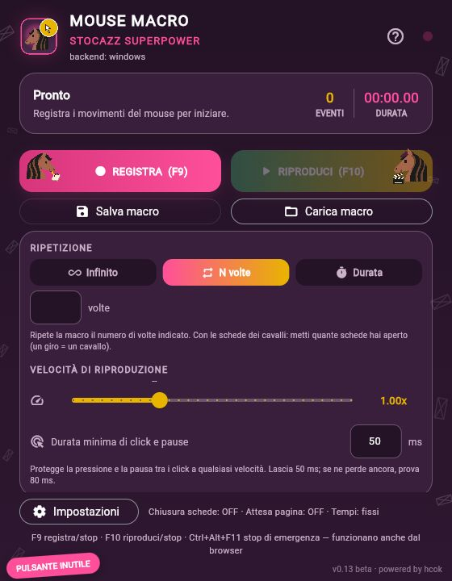
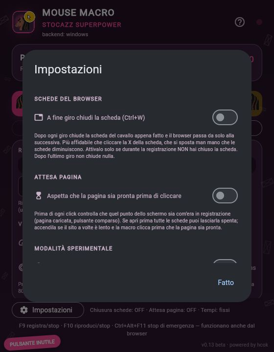

# Mouse Macro Stocazz Superpower

Registra movimenti, click e rotella del mouse e riproducili quando vuoi.
App desktop Windows e Linux, in italiano e inglese.
**v0.13 beta · powered by hcok**

[English](README.md) · [Avvio e compilazione](docs/BUILD.md) · [Collaudo](COLLAUDO.md)

 

Le schermate mostrano la vera interfaccia Flet nel browser locale per il controllo
visivo. Il programma distribuito rimane un'applicazione desktop.

## Funzioni e uso

- Registra movimenti, tre pulsanti e rotella. Ripete N volte, all'infinito o per durata.
- Velocità 0,1×–3×, con minimo iniziale modificabile di 50 ms per click e pause,
  a qualsiasi velocità. Le attese lunghe si accelerano al massimo di 1,5×.
- Carica e salva `.mmr` con finestre native; legge anche i vecchi `.json` compatibili.
- Su Windows: tasti globali, attesa visiva della pagina e Ctrl+W tra giri.
  Variazione dei tempi opzionale su entrambe le piattaforme.

F9 registra/ferma; F10 riproduce/interrompe; Ctrl+Alt+F11 richiede lo stop di emergenza.
N volte è selezionato inizialmente e il campo è vuoto: inserisci tu il numero di giri.
Su Linux i tasti richiedono la finestra attiva; servono GTK 3, Zenity e permessi
mouse/uinput. I binari sono stati verificati su CachyOS x86_64; distro più vecchie
possono richiedere compilazione nativa.

Conserva posizione, dimensioni e zoom della finestra di destinazione. Windows usa
coordinate assolute, Linux movimenti relativi dal punto iniziale del cursore.
Le registrazioni delle due piattaforme non sono intercambiabili.

58 test superati su Windows, 32 su Linux e diagnostica superata sui quattro
eseguibili. GUI native e risultato dei click sul sito restano da provare manualmente.
[Dettagli del collaudo](COLLAUDO.md).

Ideazione e progetto: **hcok**. Sviluppato con assistenza di Claude e Codex.
Non è ancora stata scelta una licenza di distribuzione.
