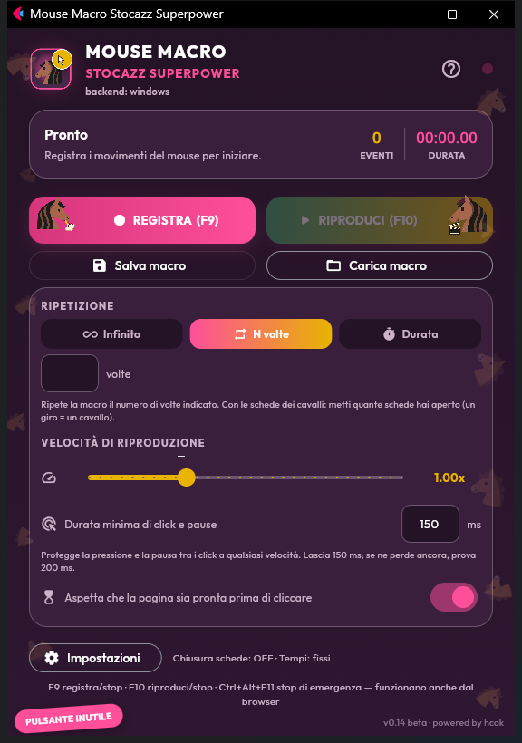
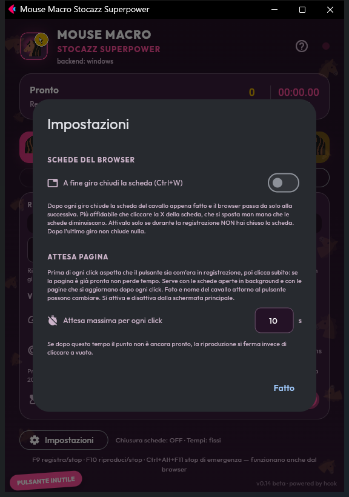
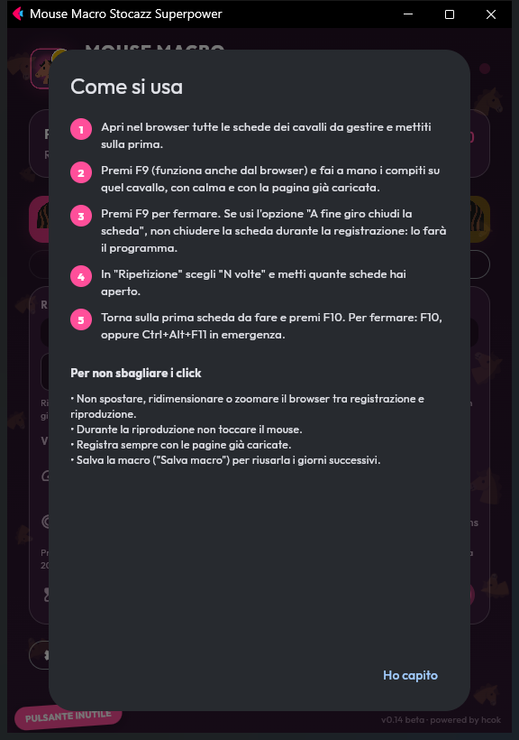

# Mouse Macro Stocazz Superpower

**Registra il mouse una volta, riproducilo quante volte vuoi, senza perdere click.**
Un piccolo programma per Windows e Linux, in italiano e in inglese.

**v0.14 beta · powered by hcok** · [English](README.md) · [Download](#download) · [Compilazione](docs/BUILD.md) · [Collaudo](COLLAUDO.md)

## Perché è nato

È nato da un lavoro molto concreto e molto ripetitivo: un gioco nel browser giocato su
una ventina di schede, dove su ogni scheda va fatta la stessa sequenza di click, tutti
i giorni. Gli altri programmi di macro ci riuscivano a velocità normale, ma **appena si
aumentava la velocità della riproduzione cominciavano a perdere click**: le pressioni
diventavano così brevi, o così ravvicinate, che la pagina le ignorava.

Il programma è costruito attorno a due idee:

1. **Registrare fedelmente e riprodurre uguale**: posizioni assolute del cursore, tempi
   reali dei click, coordinate corrette anche con lo scaling di Windows. Riproduzione
   all'infinito, per N volte o per un tempo stabilito.
2. **Andare più veloce senza perdere click**: una *durata minima* (150 ms di base,
   come un normale click umano)
   protegge sia quanto dura ogni click sia la pausa prima del successivo, a qualsiasi
   velocità.

## Cosa fa

- Registra movimenti, click sinistro/destro/centrale e rotellina.
- Riproduce **all'infinito**, **N volte** (per esempio un giro per ogni scheda aperta) o per
  una **durata**.
- Velocità da 0,1× a 3×; la durata minima di click e pause è sempre rispettata, e le attese
  lunghe (caricamento delle pagine) vengono accelerate al massimo di 1,5×.
- Tasti rapidi che funzionano anche dal browser: **F9** registra/stop, **F10** riproduci/stop,
  **Ctrl+Alt+F11** stop di emergenza (su Linux serve la finestra dell'app attiva).
- **Attesa pagina** (Windows, attiva di base, nella schermata principale): prima di ogni click
  aspetta che il pulsante sia com'era in registrazione, poi clicca subito. Se la pagina è pronta
  non si perde tempo; copre le pagine che si aggiornano dopo ogni click e le schede aperte in
  background, che il browser carica solo quando le mostri. Confronta solo il pulsante, quindi foto
  e nome del cavallo attorno possono cambiare. Se una pagina non è pronta entro 10 s (regolabili),
  la riproduzione si ferma e dice quale click stava aspettando.
- Opzioni facoltative, spente all'inizio:
  - **A fine giro chiudi la scheda** (Ctrl+W), così il browser passa da solo alla successiva;
  - **Tempi variabili a ogni giro** (sperimentale).
- Salva e carica le macro (`.mmr`), con il controllo dello schermo: una macro registrata con
  un'altra risoluzione non parte a cliccare nei punti sbagliati.

## Download

Scarica l'ultima versione dalla [pagina delle release](../../releases/latest):

| Sistema | Italiano | English |
| --- | --- | --- |
| Windows 10/11 (64 bit) | `MouseMacroStocazzSuperpower-Windows-IT.exe` | `MouseMacroStocazzSuperpower-Windows-EN.exe` |
| Linux x86_64 | `MouseMacroStocazzSuperpower-Linux-IT.tar.gz` | `MouseMacroStocazzSuperpower-Linux-EN.tar.gz` |

In ogni release c'è `SHA256SUMS.txt` per verificare i file. Non serve installare niente:
l'`.exe` per Windows è un file unico che si avvia da qualsiasi cartella.

### Windows: il primo avvio

Gli eseguibili non sono firmati digitalmente, quindi la prima volta Windows può mostrare
**"PC protetto da Windows"** (SmartScreen): clicca **Ulteriori informazioni → Esegui comunque**.

**Smart App Control** (Windows 11): le versioni precedenti aprivano la finestra con `flet.exe`,
un programma di supporto di Flet non firmato che Smart App Control blocca sempre. Dalla v0.14
l'interfaccia compare in una **finestra di Microsoft Edge in modalità app** (senza barra degli
indirizzi né schede: sembra un programma normale), quindi quel file non c'è più. L'eseguibile
però non è ancora firmato: su un PC con Smart App Control **attivo**, Windows chiede un parere al
cloud di Microsoft e può comunque bloccarlo ("Un criterio di controllo dell'applicazione ha
bloccato il file"). La firma digitale è prevista; fino ad allora, su quei PC l'unica soluzione è
disattivare Smart App Control. L'interfaccia è visibile
solo da questo computer (`127.0.0.1`, su un percorso segreto casuale), tutto ciò che le serve
è incluso nel programma, e chiudendo la finestra si chiude anche il programma.

I PC gestiti da un'azienda o da una scuola possono bloccare comunque qualsiasi programma non
approvato: in quel caso bisogna chiedere all'amministratore.

### Linux

Estrai l'archivio e avvia l'eseguibile (se serve, `chmod +x`). Richiede GTK 3 e Zenity, i
permessi di lettura del mouse in `/dev/input` per registrare e di scrittura su `/dev/uinput`
per riprodurre. Usa la configurazione dei permessi della tua distribuzione (gruppo `input`
o regola udev): **non avviare il programma come root**. Su Linux i movimenti vengono
riprodotti a partire dalla posizione iniziale del cursore.

## Come si usa

1. Apri nel browser tutte le schede che ti servono e mettiti sulla prima.
2. Premi **F9** e fai il lavoro a mano, con calma e con la pagina già caricata.
3. Premi di nuovo **F9** per fermare.
4. In **Ripetizione** scegli **N volte** e scrivi quante schede hai aperto.
5. Torna sulla prima scheda e premi **F10**. Per fermare: **F10**, oppure **Ctrl+Alt+F11**.

Per non sbagliare i click: non spostare, ridimensionare o zoomare il browser tra
registrazione e riproduzione, non toccare il mouse durante la riproduzione e registra
con le pagine già caricate. Con **Salva macro** puoi riusare la registrazione nei giorni
successivi.

 

## Storia delle versioni

| Versione | Data | Novità principali |
| --- | --- | --- |
| v0.14 beta | 30/09/2026 | Click minimo di 150 ms (prima 50); *Attesa pagina* attiva di base, nella schermata principale, senza badare alla foto del cavallo attorno al pulsante; finestra Edge invece di `flet.exe` non firmato; finestre Apri/Salva native di Windows; font inclusi per l'uso offline; 38 MB invece di 64; licenza MIT; compilazione automatica |
| — | 30/09/2026 | Linux: tasti F9/F10 e chiusura delle schede |
| [v0.13 beta](../../releases/tag/v0.13-beta) | 30/09/2026 | Versione inglese; carica/salva più sicuri; diagnostica integrata; build Windows e Linux |
| v0.4 | 30/09/2026 | Prima build Windows affidabile: DPI awareness, pausa minima tra i click, tasti rapidi globali, *Attesa pagina*, *Chiudi scheda* |
| prima versione | 29/09/2026 | Registrazione e riproduzione su Linux e Windows |

La storia completa è nei [commit](../../commits/main).

## Compilare dai sorgenti

Vedi [docs/BUILD.md](docs/BUILD.md). In breve: `pip install -r requirements.txt pyinstaller`,
poi `python build_release.py` compila le due lingue per il sistema su cui lo lanci. Le release
vengono compilate automaticamente da [GitHub Actions](.github/workflows/release.yml) quando
si pubblica un tag `v*`.

## Licenza

[MIT](LICENSE) © hcok. Font inclusi: Outfit e un sottoinsieme di un solo carattere di Noto
Color Emoji, entrambi con licenza SIL Open Font License.

Progetto e design: **hcok**. Sviluppato con l'assistenza di Claude e Codex.
