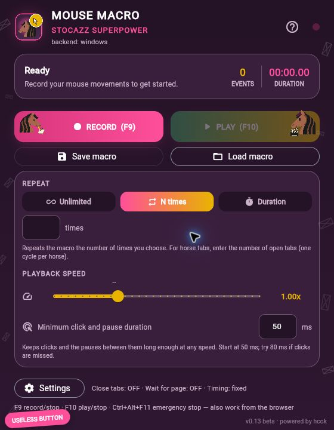
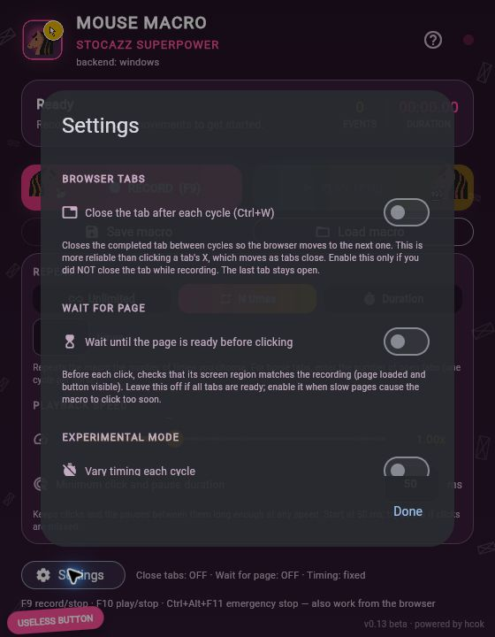

# Mouse Macro Stocazz Superpower

Record mouse movements, clicks and scrolling, then replay them.
A compact desktop app for Windows and Linux, in Italian and English.
**v0.13 beta · powered by hcok**

[Italiano](README.it.md) · [Build and runtime notes](docs/BUILD.md) · [Validation](COLLAUDO.md)

 

Screenshots show the actual Flet interface rendered in a local browser for visual
checks. Distributed builds are desktop applications.

## Features

- Movement, left/right/middle clicks and scroll recording.
- Replay a chosen number of cycles, indefinitely or for a chosen duration.
- Speed from 0.1× to 3×, with an editable 50 ms minimum for clicks and pauses
  at any speed. Long waits are accelerated by at most 1.5×.
- Save/load `.mmr` through native dialogs; compatible legacy `.json` supported.
- Windows: global shortcuts, optional visual readiness checks and Ctrl+W between
  cycles. Optional timing variation on both platforms.

## Usage

Choose the IT or EN build for your system. F9 starts/stops recording; F10 starts/
stops playback; Ctrl+Alt+F11 requests emergency stop. **N times** is selected
initially, with an empty count: enter your own number of cycles.

On Linux the shortcuts require app focus. Linux also requires GTK 3, Zenity and
access to mouse/uinput devices. Builds were tested on CachyOS x86_64; older
distributions may need a native build.

Keep the target window position, size and zoom unchanged. Windows uses absolute
coordinates; Linux replays relative motion from the cursor's starting point.
Recordings from the two platforms are not interchangeable.

## Status

58 automatic tests passed on Windows and 32 on Linux. All four packaged binaries
passed headless diagnostics. Native GUI actions and click outcomes on a particular
website still require manual validation: see [details](COLLAUDO.md).

Project and design: **hcok**. Developed with assistance from Claude and Codex.
No distribution licence has been selected yet.
