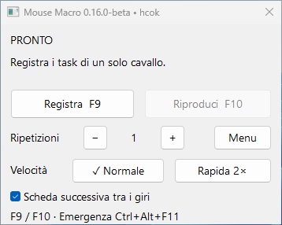
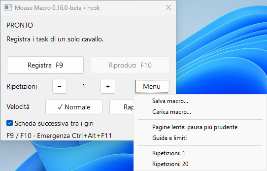
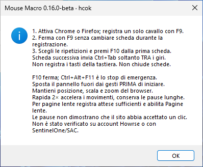

<b>English</b> · <a href="README.it.md">Italiano</a>

# Mouse Macro Stocazz Superpower

Record mouse movement, clicks, dragging and scrolling. Replay the sequence from a compact, always-on-top Windows panel.

**[Download v0.16.0 beta for Windows](https://github.com/realfulvio/mouse-macro-stocazz-superpower/releases/tag/v0.16.0-beta)** · Project and design: **hcok**. v0.16 implementation: **by codex**.

## Start

1. Download `MouseMacroStocazzSuperpower-Windows-v0.16.0-beta-by-codex.zip` from the release.
2. Extract the **entire** ZIP folder.
3. Open `Mouse Macro v0.16.0-beta-by-codex.exe`.

Requires x64 Windows with .NET Framework 4; tested on Windows 11. Python is bundled: no Python installation or first-run download is needed. The launcher is unsigned. The new Windows interface is **Italian only**.

## Record and replay

1. Activate Chrome or Firefox and move the panel away from the recorded targets.
2. Press **F9**, perform the sequence on one tab, then press **F9** again.
3. Choose repeat count and speed. Press **F10** to play or stop.
4. Use **Ctrl+Alt+F11** for the emergency stop.

**Scheda successiva** sends Ctrl+Tab between cycles. Open the tabs beforehand in the same browser window; activate another window manually. Keep browser position, zoom, screen resolution and scaling consistent with the recording.

The menu offers Save/Load, 20-repeat preset, **Pagine lente** (slow pages), and help. Rapid 2× speeds up movement while preserving long pauses, so total runtime may improve only modestly. Slow-page mode adds more cautious pauses; it does not detect page readiness.

## Tested behavior and limits

The published ZIP passed **41 acceptance checks**: Chrome and Firefox, 20 cycles per speed with no lost actions on a local test page, five tabs/two windows, stop and held-button release, native file dialogs, 100%/150% display scaling, and offline startup. Windows unit suite: 102 passed, 6 skipped.

The app sends inputs at recorded coordinates. It cannot confirm a website accepted them and never retries automatically. The new panel does not record keyboard keys, close tabs or repeat infinitely. Real Howrse accounts, SentinelOne and Smart App Control were not tested. See the [full acceptance report](docs/ESITO-COLLAUDO-v0.16.md).

## Linux and development

Linux retains the historical Flet IT/EN interface; this release updates Windows. Linux binaries remain available in [v0.14 beta](https://github.com/realfulvio/mouse-macro-stocazz-superpower/releases/tag/v0.14-beta).

- [Italian guide](GUIDA-ITALIANA.md)
- [v0.16 build and acceptance instructions](BUILD-v0.16-by-codex.md)
- [All releases](https://github.com/realfulvio/mouse-macro-stocazz-superpower/releases)
- [License](LICENSE)
