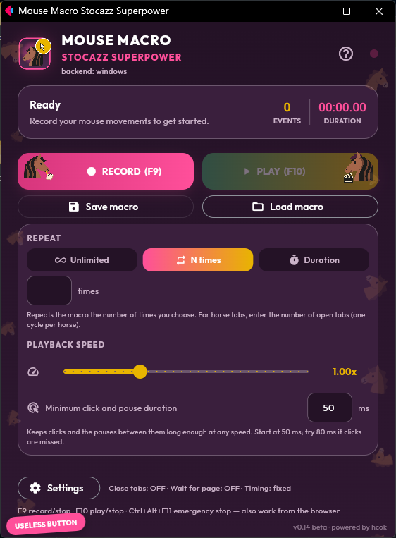
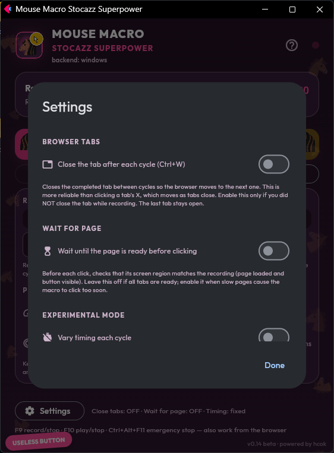
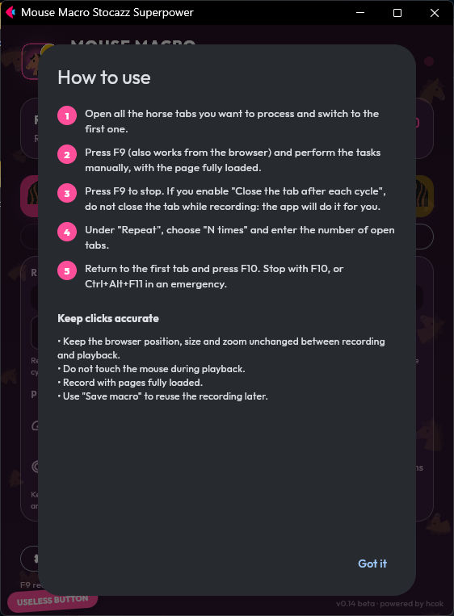

# Mouse Macro Stocazz Superpower

**Record your mouse once, replay it as many times as you like, without losing clicks.**
A small desktop app for Windows and Linux, in English and Italian.

**v0.14 beta · powered by hcok** · [Italiano](README.it.md) · [Download](#download) · [Build](docs/BUILD.md) · [Validation](COLLAUDO.md)

## Why it exists

It started from a very concrete, very repetitive job: a browser game played across
twenty-odd tabs, where every tab needs the same sequence of clicks, every day.
Existing macro tools could do it at normal speed, but **as soon as playback was
sped up they started losing clicks**: presses got so short, or so close together,
that the page ignored them.

So this app was built around two ideas:

1. **Record faithfully and replay exactly**: absolute cursor positions, real click
   timing, DPI-aware coordinates. Replay forever, N times, or for a set duration.
2. **Go faster without losing clicks**: a *minimum click duration* (50 ms by default)
   protects both how long each click is held and the pause before the next one,
   at any speed.

## What it does

- Records mouse movement, left/right/middle clicks and scrolling.
- Replays **indefinitely**, **N times** (e.g. one cycle per open tab) or for a **duration**.
- Speed from 0.1× to 3×; the minimum click/pause duration is always respected, and long
  waits (page loads) are accelerated by at most 1.5×.
- Global shortcuts that also work from the browser: **F9** record/stop, **F10** play/stop,
  **Ctrl+Alt+F11** emergency stop (Windows; on Linux they need the app window focused).
- Optional, off by default:
  - **Close the tab after each cycle** (Ctrl+W), so the browser moves on to the next tab;
  - **Wait for page** (Windows): before each click, wait until that spot looks exactly like
    it did while recording (page loaded, button visible);
  - **Vary timing each cycle** (experimental).
- Save and load macros (`.mmr`), with checks on the screen layout: a macro recorded at a
  different resolution won't start clicking in the wrong places.

## Download

Get the latest version from the [Releases page](../../releases/latest):

| System | English | Italiano |
| --- | --- | --- |
| Windows 10/11 (64-bit) | `MouseMacroStocazzSuperpower-Windows-EN.exe` | `MouseMacroStocazzSuperpower-Windows-IT.exe` |
| Linux x86_64 | `MouseMacroStocazzSuperpower-Linux-EN.tar.gz` | `MouseMacroStocazzSuperpower-Linux-IT.tar.gz` |

`SHA256SUMS.txt` in each release lets you verify the files. Nothing to install: the
Windows `.exe` is a single file you can run from anywhere.

### Windows: first launch

The executables are not code-signed, so the first time Windows may show
**"Windows protected your PC"** (SmartScreen): click **More info → Run anyway**.

**Smart App Control** (Windows 11) is supported. Earlier versions opened their window
through Flet's own `flet.exe`, an unsigned helper that Smart App Control blocks outright.
Since v0.14 the interface is shown in a **Microsoft Edge window in app mode** (no address
bar, no tabs: it looks like a normal program). Edge is signed by Microsoft and present on
every Windows 10/11 PC. The interface is served only to this computer (`127.0.0.1`, on a
random secret path), everything it needs is loaded locally, and closing the window closes the program.

PCs managed by a company or school may block any unapproved program regardless: in that
case ask the administrator.

### Linux

Extract the archive and run the executable (`chmod +x` it if needed). It needs GTK 3 and
Zenity, read access to the mouse under `/dev/input` for recording and write access to
`/dev/uinput` for playback. Use your distribution's usual permission setup (e.g. the
`input` group or a udev rule): **do not run the app as root**. On Linux, movements are
replayed relative to where the cursor starts.

## How to use

1. Open all the browser tabs you need and switch to the first one.
2. Press **F9** and do the job by hand, calmly, with the page already loaded.
3. Press **F9** again to stop.
4. Under **Repeat** choose **N times** and type how many tabs you opened.
5. Go back to the first tab and press **F10**. To stop: **F10**, or **Ctrl+Alt+F11**.

To keep clicks accurate: don't move, resize or zoom the browser between recording and
playback, don't touch the mouse during playback, and record with pages fully loaded.
Use **Save macro** to reuse a recording on the following days.

 

## Version history

| Version | Date | Highlights |
| --- | --- | --- |
| v0.14 beta | 30/09/2026 | Works with Windows Smart App Control (Edge app window, no `flet.exe`); native Windows open/save dialogs; fonts bundled for offline use; 38 MB instead of 64 MB; MIT licence; automated builds |
| — | 30/09/2026 | Linux: F9/F10 shortcuts and tab closing |
| [v0.13 beta](../../releases/tag/v0.13-beta) | 30/09/2026 | English version; safer load/save; self-test diagnostics; Windows and Linux builds |
| v0.4 | 30/09/2026 | First reliable Windows build: DPI awareness, minimum pause between clicks, global shortcuts, *Wait for page*, *Close tab* |
| first version | 29/09/2026 | Record and replay on Linux and Windows |

The full history is in the [commits](../../commits/main).

## Build from source

See [docs/BUILD.md](docs/BUILD.md). In short: `pip install -r requirements.txt pyinstaller`,
then `python build_release.py` builds both languages for the OS you run it on. Releases are
built automatically by [GitHub Actions](.github/workflows/release.yml) when a `v*` tag is pushed.

## Licence

[MIT](LICENSE) © hcok. Bundled fonts: Outfit and a one-glyph subset of Noto Color Emoji,
both under the SIL Open Font License.

Project and design: **hcok**. Developed with assistance from Claude and Codex.
