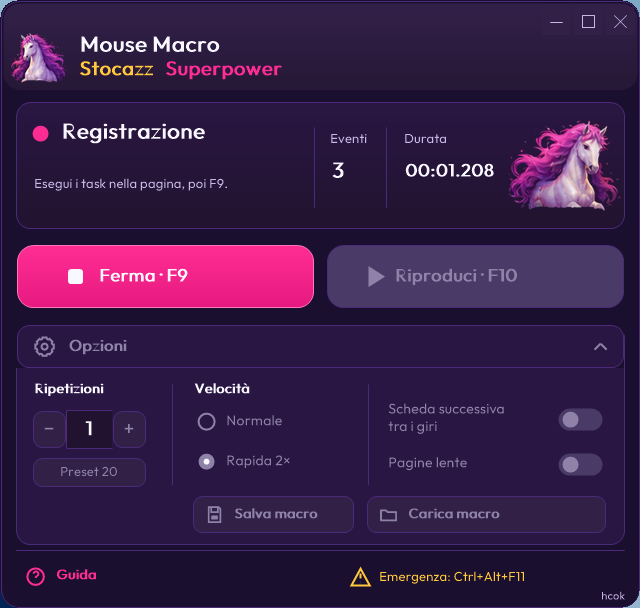

<b>English</b> · <a href="README.it.md">Italiano</a>

# Mouse Macro Stocazz Superpower

Record mouse movement, clicks, dragging and scrolling. Replay the sequence from a compact, expandable Windows window that stays on top. Outfit, horses and the plum, pink, purple and yellow palette follow the approved visual direction.

**[Download v0.18.1 beta for Windows](https://github.com/realfulvio/mouse-macro-stocazz-superpower/releases/tag/v0.18.1-beta)** · Project and design: **hcok**.

**v0.18.1-beta** removes the Chrome/Firefox restriction and records/replays across applications and the desktop. It retains the v0.18 changes: starts with tab switching disabled and accelerates ordinary interaction pauses in Rapid 2×. The layout is unchanged from the v0.17 screenshots below. [Changes, timing measurements and acceptance status](docs/ESITO-COLLAUDO-v0.18.1.md) · [v0.18.1 build](BUILD-v0.18.1.md).

## Start

1. Download `MouseMacroStocazzSuperpower-Windows-v0.18.1-beta.zip` from the release.
2. Extract the **entire** ZIP folder.
3. Open `Mouse Macro v0.18.1-beta.exe`.

Requires x64 Windows with .NET Framework 4; tested on Windows 11. Python is bundled: no Python installation or first-run download is needed. The launcher is unsigned. The Windows interface is **Italian only**. These screenshots show real controls and counters in the running application.

## Record and replay

1. Prepare the applications to use and move the panel away from the recorded targets.
2. Press **F9**, perform the mouse sequence, then press **F9** again.
3. Choose repeat count and speed. Press **F10** to play or stop.
4. Use **Ctrl+Alt+F11** for the emergency stop.

**Scheda successiva** starts disabled. When enabled, it sends Ctrl+Tab only between cycles, never after the last one. Open the tabs beforehand in the same browser window; record window changes using mouse clicks. Keep window positions, screen resolution and scaling consistent with the recording.

Open **Opzioni** for Save/Load, the 20-repeat preset, speed and **Pagine lente** (slow pages). Help and Emergency remain in the footer. Play and Save are disabled until a valid macro exists. Rapid 2× accelerates movement and ordinary pauses up to 2 s, while waits over 2 s stay at 1×. The minimum action gap drops from 650 to 325 ms; button holds and double clicks stay protected. Total duration is not necessarily halved. Slow-page mode adds more cautious pauses; it does not detect page readiness.

## Tested behavior and limits

The exact v0.18.1 ZIP passed **18 interactive checks** on Windows 11 LTSC: recording/replay across two native windows and the desktop, plus 14 browser regressions (clicks/double clicks, drag, wheel, 20 cycles, tab switching OFF/ON, F10 and emergency stop). No clicks were lost. The sequence across windows takes **6.841 s at 1× and 3.855 s at 2×**. Windows suite: **112 passed, 6 skipped**; Linux: **67 passed, 51 skipped**. [Results and limits](docs/ESITO-COLLAUDO-v0.18.1.md).

The app sends inputs at recorded coordinates. It cannot confirm a website accepted them and never retries automatically. The new panel does not record keyboard keys, close tabs or repeat infinitely. Real Howrse accounts, SentinelOne and Smart App Control were not tested. See the [full acceptance report](docs/ESITO-COLLAUDO-v0.18.1.md).

## Linux and development

Linux retains the historical Flet IT/EN interface; this release updates Windows. Linux binaries remain available in [v0.14 beta](https://github.com/realfulvio/mouse-macro-stocazz-superpower/releases/tag/v0.14-beta).

- [Italian guide](GUIDA-ITALIANA.md)
- [v0.18 build and acceptance instructions](BUILD-v0.18.1.md)
- [All releases](https://github.com/realfulvio/mouse-macro-stocazz-superpower/releases)
- [Approved UI implementation](docs/design/README.md)
- [License](LICENSE)
